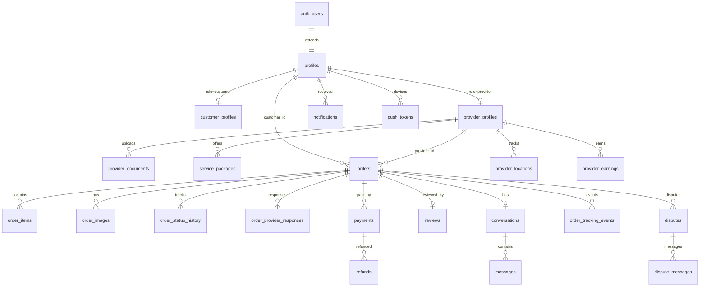

# UniMove — Database Schema Documentation

> Tài liệu mô tả cấu trúc database PostgreSQL trên **Supabase** cho nền tảng marketplace dịch vụ chuyển trọ sinh viên **UniMove**.
>
> **Phiên bản:** MVP (sau tối ưu `manual_fix_step4_optimize_mvp.sql`)  
> **Cập nhật:** 2026-05-29

---

## Mục lục

1. [Tổng quan Database](#1-tổng-quan-database)
2. [Kiến trúc & quan hệ](#2-kiến-trúc--quan-hệ)
3. [Thống kê](#3-thống-kê)
4. [Cài đặt & Migration](#4-cài-đặt--migration)
5. [Nhóm bảng MVP-CORE](#5-nhóm-bảng-mvp-core)
6. [Nhóm bảng MVP-OPTIONAL](#6-nhóm-bảng-mvp-optional)
7. [Bảng đã loại bỏ](#7-bảng-đã-loại-bỏ)
8. [ENUM Types](#8-enum-types)
9. [Views & Functions](#9-views--functions)
10. [Luồng nghiệp vụ chính](#10-luồng-nghiệp-vụ-chính)
11. [Convention & best practices](#11-convention--best-practices)
12. [Tài liệu liên quan](#12-tài-liệu-liên-quan)

---

## 1. Tổng quan Database

### 1.1 Mục đích

Database UniMove lưu trữ toàn bộ dữ liệu nghiệp vụ của marketplace kết nối **sinh viên (customer)** với **nhà cung cấp vận chuyển (provider)**, bao gồm:

- Quản lý tài khoản đa vai trò (customer / provider / admin)
- Đặt dịch vụ chuyển trọ, theo dõi đơn hàng real-time
- Thanh toán PayOS với cơ chế escrow (đặt cọc → giữ → release)
- Chat, thông báo push (FCM), đánh giá và xử lý tranh chấp

### 1.2 Technology Stack

| Thành phần | Công nghệ |
|---|---|
| Database | PostgreSQL 15+ |
| Platform | Supabase (BaaS) |
| Auth | Supabase Auth (`auth.users`) |
| Realtime | Supabase Realtime Subscriptions |
| Geospatial | PostGIS extension |
| Security | Row Level Security (RLS) |
| File storage | Supabase Storage / Cloudinary (URL lưu trong DB) |

### 1.3 Schema design

Database sử dụng mô hình **profile tách bảng theo role**:

```
auth.users
    └── profiles (thông tin chung)
            ├── customer_profiles (sinh viên)
            └── provider_profiles (nhà cung cấp)
```

> **Lý do:** Phân tách dữ liệu customer/provider rõ ràng, dễ query và mở rộng mà không làm phình bảng `profiles`.

### 1.4 Phạm vi MVP

Sau tối ưu MVP, database gồm **~37 bảng** trong schema `public`:

- **25 bảng MVP-CORE** — team Flutter **bắt buộc** implement
- **11 bảng MVP-OPTIONAL** — giữ trong DB, code UI ở Phase 2
- **1 bảng hệ thống** PostGIS (`spatial_ref_sys`)
- **10 bảng đã xóa** — không dùng (xem [mục 7](#7-bảng-đã-loại-bỏ))

Chi tiết phạm vi implement: [`mvp-database-scope.md`](./mvp-database-scope.md)

---

## 2. Kiến trúc & quan hệ

### 2.1 Sơ đồ tổng quan



### 2.2 Luồng dữ liệu chính

```
Flutter App
    ↓ Supabase Client (JWT)
profiles / orders / payments / messages ...
    ↓ RLS Policy kiểm tra quyền
PostgreSQL + PostGIS
    ↓ Realtime broadcast
Customer / Provider / Admin apps
```

---

## 3. Thống kê

| Metric | Giá trị |
|---|---|
| Tổng bảng ứng dụng | **~36** (+ 1 PostGIS system) |
| Bảng MVP-CORE | **25** |
| Bảng MVP-OPTIONAL | **11** |
| ENUM types | **13** |
| Views | **4** |
| Functions | **15+** |
| Extensions | `uuid-ossp`, `postgis` |

### Phân bổ theo nhóm chức năng

| Nhóm | Số bảng | Tag |
|---|---|---|
| Users & Profiles | 4 | MVP-CORE |
| Orders & Bookings | 6 | MVP-CORE |
| Payments & Finance | 5 core + 4 optional | MIX |
| Tracking & Location | 2 core + 3 optional | MIX |
| Chat & Notifications | 5 core + 2 optional | MIX |
| Reviews & Disputes | 4 core + 1 optional | MIX |
| Business Config | 1 core + 3 optional | MIX |

---

## 4. Cài đặt & Migration

### 4.1 Thứ tự chạy script (Supabase live DB)

| Bước | File | Mô tả |
|---|---|---|
| 1 | `backend/supabase/manual_fix_step1_enums.sql` | Thêm ENUM values |
| 2 | `backend/supabase/manual_fix_step2_main.sql` | Bảng/cột/triggers/RLS mới |
| 3 | `backend/supabase/manual_fix_step3_templates.sql` | Notification templates |
| 4 | `backend/supabase/manual_fix_step4_optimize_mvp.sql` | Xóa bảng thừa, gỡ cột trùng |

> **Lưu ý:** Bước 1 và 3 phải chạy **riêng transaction** (PostgreSQL yêu cầu commit enum trước khi INSERT).

### 4.2 Fresh install (migration files)

```
backend/supabase/migrations/
├── 20240101000000_initial_schema.sql
├── 20240102000000_orders_and_bookings.sql
├── ...
├── 20240110000000_business_flow_optimizations.sql
└── 20240111000000_mvp_cleanup.sql
```

### 4.3 Kiểm tra kết nối

```bash
cd backend
npm install
npm test
```

### 4.4 Environment variables (`.env` ở root repo)

| Biến | Mô tả |
|---|---|
| `SUPABASE_URL` | URL project Supabase |
| `SUPABASE_ANON_KEY` | Public anon key (Flutter client) |
| `SUPABASE_SERVICE_ROLE_KEY` | Service role (backend/admin only) |
| `DATABASE_URL` | PostgreSQL connection string |

---

## 5. Nhóm bảng MVP-CORE

> **25 bảng** — bắt buộc implement trong MVP.

---

### 5.1 Users & Profiles (4 bảng)

#### `profiles`
Bảng profile gốc, mở rộng từ `auth.users`.

| Cột | Kiểu | Mô tả |
|---|---|---|
| `id` | UUID PK | = `auth.users.id` |
| `email` | TEXT UNIQUE | Email đăng nhập |
| `phone` | TEXT | Số điện thoại |
| `full_name` | TEXT | Họ tên |
| `avatar_url` | TEXT | Ảnh đại diện |
| `date_of_birth` | DATE | Ngày sinh |
| `gender` | gender_type | Nam / Nữ |
| `role` | user_role | `customer` / `provider` / `admin` |
| `status` | user_status | Trạng thái tài khoản |
| `onboarding_completed` | BOOLEAN | Đã xong tutorial lần đầu |
| `referral_code` | TEXT UNIQUE | Mã giới thiệu cá nhân |
| `referred_by` | UUID FK → profiles | Người giới thiệu |
| `last_seen_at` | TIMESTAMPTZ | Lần cuối online |
| `created_at` / `updated_at` | TIMESTAMPTZ | Timestamps |

---

#### `customer_profiles`
Thông tin bổ sung cho sinh viên.

| Cột | Kiểu | Mô tả |
|---|---|---|
| `id` | UUID PK FK → profiles | |
| `student_id` | TEXT | Mã sinh viên |
| `university` | TEXT | Trường đại học |
| `address`, `city`, `district`, `ward` | TEXT | Địa chỉ |
| `total_orders` | INTEGER | Tổng đơn đã đặt |
| `total_spent` | NUMERIC | Tổng chi tiêu (VNĐ) |
| `loyalty_points` | INTEGER | Điểm tích lũy |
| `preferred_payment_method` | TEXT | Phương thức thanh toán ưa thích |

---

#### `provider_profiles`
Thông tin nhà cung cấp dịch vụ vận chuyển.

| Cột | Kiểu | Mô tả |
|---|---|---|
| `id` | UUID PK FK → profiles | |
| `business_name` | TEXT | Tên doanh nghiệp / tài xế |
| `business_license`, `tax_code` | TEXT | Giấy phép, mã số thuế |
| `vehicle_type` | TEXT | Loại xe |
| `vehicle_capacity` | TEXT | Tải trọng |
| `vehicle_plate` | TEXT | Biển số xe |
| `vehicle_images` | TEXT[] | Ảnh xe |
| `service_area` | TEXT[] | Khu vực hoạt động |
| `base_price`, `price_per_km`, `price_per_floor` | NUMERIC | Bảng giá |
| `rating` | NUMERIC(3,2) | Rating trung bình |
| `total_reviews`, `total_orders` | INTEGER | Thống kê |
| `total_earnings` | NUMERIC | Tổng thu nhập |
| `is_verified` | BOOLEAN | Đã xác thực bởi admin |
| `is_available` | BOOLEAN | Đang rảnh nhận đơn |
| `verification_status` | TEXT | `pending` / `approved` / `rejected` |
| `bank_name`, `bank_account_number`, `bank_account_name` | TEXT | Thông tin ngân hàng |

---

#### `provider_documents`
Giấy tờ xác minh KYC.

| Cột | Kiểu | Mô tả |
|---|---|---|
| `id` | UUID PK | |
| `provider_id` | UUID FK → provider_profiles | |
| `document_type` | TEXT | `id_card`, `license`, `vehicle_registration`, `insurance` |
| `document_url` | TEXT | URL file trên Storage |
| `document_number` | TEXT | Số giấy tờ |
| `issue_date`, `expiry_date` | DATE | Ngày cấp / hết hạn |
| `is_verified` | BOOLEAN | Admin đã duyệt |
| `verified_by` | UUID FK → profiles | Admin duyệt |
| `notes` | TEXT | Ghi chú admin |

---

### 5.2 Orders & Bookings (6 bảng)

#### `orders`
Bảng trung tâm — đơn chuyển trọ.

| Cột | Kiểu | Mô tả |
|---|---|---|
| `id` | UUID PK | |
| `order_number` | TEXT UNIQUE | Mã đơn `UNI-YYYYMMDD-XXXX` (auto) |
| `customer_id` | UUID FK → profiles | Khách hàng |
| `provider_id` | UUID FK → provider_profiles | Provider được gán |
| `service_type` | service_type | `standard` / `express` / `premium` |
| `vehicle_size` | vehicle_size | Kích thước xe cần |
| **Pickup** | | `pickup_address`, `pickup_city`, `pickup_district`, `pickup_ward`, `pickup_latitude/longitude`, `pickup_floor`, `pickup_has_elevator`, `pickup_contact_name/phone`, `pickup_notes` |
| **Delivery** | | Tương tự pickup với prefix `delivery_` |
| **Pricing** | | `estimated_distance`, `base_price`, `distance_price`, `floor_price`, `service_fee`, `discount_amount`, `total_price` |
| **Escrow** | | `deposit_amount`, `deposit_paid`, `deposit_paid_at`, `remaining_amount`, `payment_released`, `payment_released_at` |
| **Timing** | | `scheduled_pickup_time`, `actual_pickup_time`, `actual_delivery_time`, `completed_at` |
| **Status** | | `status` (order_status), `cancellation_reason`, `cancelled_by`, `cancelled_at` |
| **Shared Move** | | `is_group_order`, `group_order_id`, `shared_move_discount`, `shared_move_group_id` |
| **Meta** | | `number_of_rooms`, `estimated_weight`, `has_fragile_items`, `requires_helpers`, `number_of_helpers`, `has_insurance`, `has_packing_service` |
| **Links** | | `service_package_id`, `promotion_id`, `provider_accepted_at`, `customer_confirmed_at`, `eta_minutes` |

---

#### `order_items`
Chi tiết từng món đồ (tủ lạnh, bàn ghế...).

| Cột | Kiểu | Mô tả |
|---|---|---|
| `id` | UUID PK | |
| `order_id` | UUID FK → orders | |
| `item_name` | TEXT | Tên đồ |
| `quantity` | INTEGER | Số lượng |
| `estimated_weight` | NUMERIC | Khối lượng (kg) |
| `is_fragile` | BOOLEAN | Dễ vỡ |
| `notes` | TEXT | Ghi chú |
| `image_url` | TEXT | Ảnh đồ |

---

#### `order_images`
Ảnh minh chứng đơn hàng.

| Cột | Kiểu | Mô tả |
|---|---|---|
| `id` | UUID PK | |
| `order_id` | UUID FK → orders | |
| `image_url` | TEXT | URL ảnh |
| `image_type` | TEXT | `pickup_items`, `completion`, `damage` |
| `uploaded_by` | UUID FK → profiles | |
| `notes` | TEXT | |

---

#### `order_status_history`
Audit trail thay đổi trạng thái.

| Cột | Kiểu | Mô tả |
|---|---|---|
| `order_id` | UUID FK | |
| `from_status` / `to_status` | order_status | |
| `changed_by` | UUID FK → profiles | |
| `notes` | TEXT | |
| `created_at` | TIMESTAMPTZ | Auto trigger khi `orders.status` đổi |

---

#### `order_provider_responses`
Provider accept hoặc decline đơn.

| Cột | Kiểu | Mô tả |
|---|---|---|
| `order_id` | UUID FK → orders | |
| `provider_id` | UUID FK → provider_profiles | |
| `response` | provider_response | `accepted` / `declined` |
| `decline_reason` | TEXT | Lý do từ chối |
| `responded_at` | TIMESTAMPTZ | |

> **Unique:** `(order_id, provider_id)`

---

#### `service_packages`
Gói dịch vụ do provider tạo.

| Cột | Kiểu | Mô tả |
|---|---|---|
| `provider_id` | UUID FK → provider_profiles | |
| `name`, `description` | TEXT | Tên & mô tả gói |
| `service_type`, `vehicle_size` | ENUM | |
| `base_price`, `price_per_km`, `price_per_floor` | NUMERIC | Giá |
| `max_weight_kg` | NUMERIC | Tải trọng tối đa |
| `helper_count` | INTEGER | Số người phụ |
| `includes_packing`, `includes_insurance` | BOOLEAN | |
| `is_active` | BOOLEAN | Đang bán |

---

### 5.3 Payments & Finance (5 bảng core)

#### `payments`

| Cột | Kiểu | Mô tả |
|---|---|---|
| `payment_code` | TEXT UNIQUE | `PAY-YYYYMMDD-XXXX` (auto) |
| `order_id`, `customer_id` | UUID FK | |
| `amount` | NUMERIC | Số tiền (VNĐ) |
| `payment_method` | payment_method | `payos`, `momo`, `cash`... |
| `payment_purpose` | payment_purpose | `deposit` / `final` / `full` / `refund` |
| `escrow_status` | TEXT | `pending` → `held` → `released` / `refunded` |
| `status` | payment_status | Trạng thái thanh toán |
| `payos_order_id`, `payos_transaction_id`, `payos_payment_url`, `payos_qr_code` | TEXT | PayOS integration |
| `paid_at`, `expires_at` | TIMESTAMPTZ | |

---

#### `refunds`

| Cột | Kiểu | Mô tả |
|---|---|---|
| `payment_id`, `order_id` | UUID FK | |
| `refund_amount` | NUMERIC | |
| `refund_reason` | TEXT | |
| `status` | payment_status | |
| `requested_by`, `approved_by` | UUID FK → profiles | |

**Quy tắc refund MVP:**

| Tình huống | Tỷ lệ hoàn |
|---|---|
| Hủy trước khi provider accept | 100% |
| Hủy sau khi provider accept | 50% |
| Dispute (admin quyết định) | Partial theo investigation |

---

#### `provider_earnings`

| Cột | Kiểu | Mô tả |
|---|---|---|
| `provider_id` | UUID FK → provider_profiles | |
| `order_id`, `payment_id` | UUID FK | |
| `order_amount` | NUMERIC | Tổng đơn |
| `platform_commission` | NUMERIC | Hoa hồng (mặc định 15%) |
| `net_earnings` | NUMERIC | Thu nhập thực |
| `commission_rate` | NUMERIC | % hoa hồng |
| `status` | TEXT | `pending` / `available` / `withdrawn` |

> Auto tạo khi `payments.status` → `completed` (trigger).

---

#### `platform_settings`
Cấu hình platform do admin quản lý.

| Key mặc định | Giá trị | Mô tả |
|---|---|---|
| `deposit_rate` | 0.30 | Tỷ lệ đặt cọc 30% |
| `commission_rate` | 0.15 | Hoa hồng 15% |
| `shared_move_discount_rate` | 0.40 | Giảm gộp đơn 40% |
| `cancel_before_accept_refund_rate` | 1.00 | Hoàn 100% |
| `cancel_after_accept_refund_rate` | 0.50 | Hoàn 50% |
| `referral_reward_amount` | 30000 | Thưởng referral (VNĐ) |

---

### 5.4 Tracking & Location (2 bảng core)

#### `provider_locations`
Vị trí realtime của provider (1 record / provider).

| Cột | Kiểu | Mô tả |
|---|---|---|
| `provider_id` | UUID FK → provider_profiles UNIQUE | |
| `latitude`, `longitude` | NUMERIC | Tọa độ |
| `location` | GEOGRAPHY(POINT) | PostGIS point |
| `is_online`, `is_moving` | BOOLEAN | |
| `speed`, `heading`, `accuracy` | NUMERIC | |
| `battery_level` | INTEGER | 0–100 |
| `current_order_id` | UUID FK → orders | Đơn đang thực hiện |

> **Realtime:** Subscribe Supabase channel trên bảng này để cập nhật map.

---

#### `order_tracking_events`
Các mốc sự kiện trong quá trình vận chuyển.

| Cột | Kiểu | Mô tả |
|---|---|---|
| `order_id` | UUID FK → orders | |
| `provider_id` | UUID FK → provider_profiles | |
| `event_type` | TEXT | `started`, `arrived_pickup`, `picked_up`, `in_transit`, `arrived_delivery`, `completed` |
| `event_title`, `event_description` | TEXT | |
| `latitude`, `longitude`, `location` | | Vị trí tại thời điểm sự kiện |
| `metadata` | JSONB | Dữ liệu bổ sung |

---

### 5.5 Chat & Notifications (5 bảng core)

#### `conversations`
Một conversation / order (1-1 customer ↔ provider).

| Cột | Kiểu | Mô tả |
|---|---|---|
| `order_id` | UUID UNIQUE FK → orders | |
| `customer_id`, `provider_id` | UUID FK | |
| `last_message_at`, `last_message_preview` | | Tin nhắn cuối |
| `customer_unread_count`, `provider_unread_count` | INTEGER | Auto trigger |

---

#### `messages`

| Cột | Kiểu | Mô tả |
|---|---|---|
| `conversation_id` | UUID FK | |
| `sender_id` | UUID FK → profiles | |
| `sender_role` | user_role | |
| `message_type` | message_type | `text`, `image`, `location`, `system`, `order_update` |
| `content` | TEXT | Nội dung |
| `media_url`, `media_type` | TEXT | Ảnh đính kèm |
| `latitude`, `longitude` | NUMERIC | Location message |
| `is_read`, `is_delivered` | BOOLEAN | Trạng thái |

---

#### `notifications`

| Cột | Kiểu | Mô tả |
|---|---|---|
| `user_id` | UUID FK → profiles | |
| `notification_type` | notification_type | |
| `title`, `body` | TEXT | |
| `order_id`, `payment_id`, `message_id` | UUID FK | Liên kết entity |
| `is_read` | BOOLEAN | |
| `push_sent`, `email_sent` | BOOLEAN | Trạng thái gửi |

---

#### `push_tokens`
FCM token theo thiết bị (hỗ trợ multi-device).

| Cột | Kiểu | Mô tả |
|---|---|---|
| `user_id` | UUID FK → profiles | |
| `token` | TEXT | FCM token |
| `platform` | TEXT | `ios` / `android` / `web` |
| `device_id`, `device_name` | TEXT | |
| `is_active` | BOOLEAN | |

> **Convention:** Chỉ dùng bảng này cho FCM, không lưu token trên `profiles`.

---

#### `notification_templates`
Mẫu thông báo (seed sẵn tiếng Việt).

| template_key | notification_type | Mô tả |
|---|---|---|
| `order_created` | order_created | Đơn mới tạo |
| `order_accepted` | order_accepted | Provider nhận đơn |
| `order_started` | order_started | Bắt đầu vận chuyển |
| `order_completed` | order_completed | Hoàn thành |
| `payment_received` | payment_received | Thanh toán OK |
| `new_message` | new_message | Tin nhắn mới |
| `review_received` | review_received | Đánh giá mới |
| `provider_verified` | provider_verified | Xác thực provider |
| `shared_move_suggestion` | shared_move_suggestion | Gợi ý gộp đơn |

---

### 5.6 Reviews & Disputes (4 bảng core)

#### `reviews`
Đánh giá provider sau khi hoàn thành đơn (1 review / order).

| Cột | Kiểu | Mô tả |
|---|---|---|
| `order_id` | UUID UNIQUE FK | |
| `customer_id`, `provider_id` | UUID FK | |
| `rating` | INTEGER 1–5 | Rating tổng |
| `service_quality_rating`, `punctuality_rating`, `professionalism_rating`, `value_for_money_rating` | INTEGER 1–5 | Chi tiết |
| `comment`, `tags[]`, `images[]` | | Nội dung |
| `provider_response` | TEXT | Provider trả lời review |

---

#### `provider_reviews_summary`
Aggregate rating — auto cập nhật bởi trigger khi insert/update `reviews`.

| Cột | Mô tả |
|---|---|
| `average_rating` | Rating trung bình |
| `rating_1_count` ... `rating_5_count` | Phân bố sao |
| `response_rate` | % review được provider trả lời |

---

#### `disputes`
Tranh chấp đơn hàng — admin xử lý.

| Cột | Kiểu | Mô tả |
|---|---|---|
| `order_id` | UUID FK | |
| `raised_by`, `against_user_id` | UUID FK | |
| `dispute_type` | TEXT | `payment`, `service_quality`, `damage`... |
| `evidence_images[]` | TEXT[] | Bằng chứng |
| `status` | TEXT | `open` / `investigating` / `resolved` / `closed` |
| `resolution`, `refund_amount` | | Kết quả xử lý |

---

#### `dispute_messages`
Trao đổi trong quá trình xử lý dispute.

| Cột | Kiểu | Mô tả |
|---|---|---|
| `dispute_id` | UUID FK | |
| `sender_id` | UUID FK → profiles | |
| `message` | TEXT | |
| `is_internal` | BOOLEAN | Ghi chú nội bộ admin |

---

## 6. Nhóm bảng MVP-OPTIONAL

> **11 bảng** — có trong DB, implement UI ở Phase 2.

| Bảng | Mô tả | Khi implement |
|---|---|---|
| `promotions` | Mã giảm giá (WELCOME10, STUDENT15...) | UI nhập mã checkout |
| `promotion_usage` | Lịch sử dùng mã | Cùng promotions |
| `provider_withdrawals` | Yêu cầu rút tiền provider | Provider tự rút tiền |
| `payment_transactions` | Log giao dịch chi tiết | Backend/Edge Function |
| `location_history` | Lịch sử vị trí (replay route) | Analytics Phase 2 |
| `routes` | Tuyến planned/actual | Map replay |
| `distance_matrix` | Cache khoảng cách Google Maps | Performance optimization |
| `provider_availability` | Lịch rảnh theo ngày/tuần | Thay `is_available` boolean |
| `shared_move_groups` | Nhóm gộp đơn Shared Move | AI gợi ý -40% |
| `referrals` | Chương trình giới thiệu | Sau completion flow |
| `review_votes` | Vote review hữu ích | Social feature |
| `notification_preferences` | Cài đặt thông báo user | Settings screen |
| `announcements` | Thông báo hệ thống admin | Admin broadcast |

---

## 7. Bảng đã loại bỏ

Các bảng sau **đã bị xóa** bởi `manual_fix_step4_optimize_mvp.sql` — **không implement**:

| Bảng | Lý do loại bỏ | Thay thế bằng |
|---|---|---|
| `provider_bids` | Flow bidding không dùng trong MVP | `order_provider_responses` |
| `geofences` | Quá phức tạp | Google Maps + `order_tracking_events` |
| `geofence_events` | | |
| `wallets` | Chưa có flow ví | PayOS trực tiếp |
| `wallet_transactions` | | |
| `message_reactions` | Nice-to-have chat | — |
| `typing_indicators` | Nice-to-have chat | — |
| `feedback` | Trùng disputes | `disputes` |
| `feedback_responses` | | |
| `abuse_reports` | Phase 2 moderation | — |

---

## 8. ENUM Types

| ENUM | Giá trị chính |
|---|---|
| `user_role` | `customer`, `provider`, `admin` |
| `user_status` | `active`, `inactive`, `suspended`, `pending_verification` |
| `gender_type` | `male`, `female` |
| `order_status` | `pending` → `matched` → `accepted` → `picking_up` → `picked_up` → `delivering` → `in_progress` → `completed` / `cancelled` / `disputed` |
| `service_type` | `standard`, `express`, `premium` |
| `vehicle_size` | `motorbike`, `small_truck`, `medium_truck`, `large_truck` |
| `payment_status` | `pending`, `processing`, `completed`, `failed`, `refunded`, `partially_refunded`, `cancelled` |
| `payment_method` | `payos`, `momo`, `cash`, `bank_transfer`, `wallet`, `credit_card`, `debit_card` |
| `payment_purpose` | `deposit`, `final`, `full`, `refund`, `penalty` |
| `transaction_type` | `order_payment`, `refund`, `commission`, `withdrawal`, `deposit`, `penalty`, `bonus` |
| `message_type` | `text`, `image`, `location`, `system`, `order_update` |
| `notification_type` | `order_created`, `order_accepted`, `order_started`, `order_completed`, `payment_received`, `new_message`, `review_received`, `provider_verified`, `shared_move_suggestion`... |
| `notification_priority` | `low`, `normal`, `high`, `urgent` |
| `provider_response` | `accepted`, `declined` |
| `referral_status` | `pending`, `completed`, `expired` |
| `verification_status` | `pending`, `approved`, `rejected` |

> Chi tiết đầy đủ: [`database-enums-and-functions.md`](./database-enums-and-functions.md)

---

## 9. Views & Functions

### 9.1 Views

| View | Mô tả |
|---|---|
| `active_orders_view` | Đơn đang active + thông tin customer/provider |
| `provider_statistics_view` | Thống kê hiệu suất provider |
| `customer_order_summary_view` | Tóm tắt lịch sử đơn customer |
| `daily_revenue_view` | Doanh thu theo ngày (admin) |

### 9.2 Functions quan trọng

| Function | Mô tả |
|---|---|
| `find_nearby_providers(lat, lng, radius)` | Tìm provider gần điểm pickup |
| `browse_providers(...)` | Filter/sort provider (giá, rating, khoảng cách) |
| `get_order_statistics(start, end)` | Thống kê đơn theo khoảng thời gian |
| `get_admin_dashboard_stats(date)` | GMV, active users, disputes (admin) |
| `calculate_order_deposit()` | Trigger: auto tính deposit 30% |
| `release_payment_on_confirm()` | Trigger: release escrow khi customer confirm |
| `create_provider_earnings()` | Trigger: tạo earnings khi payment completed |
| `update_provider_rating()` | Trigger: cập nhật rating aggregate |
| `create_notification_from_template(...)` | Tạo notification từ template |
| `is_admin()`, `is_provider()`, `is_customer()` | Helper cho RLS policies |

---

## 10. Luồng nghiệp vụ chính

### 10.1 Customer Booking Flow

```
1. Sign up          → auth.users + profiles + customer_profiles
2. Search route     → orders (draft/pending)
3. Add items        → order_items
4. Select package   → service_packages
5. Pay deposit      → payments (purpose=deposit, escrow=held)
6. Wait provider    → order_provider_responses (accepted)
7. Track on map     → provider_locations (realtime)
8. Chat             → conversations + messages
9. Confirm done     → orders.customer_confirmed_at
10. Review          → reviews
```

### 10.2 Provider Operations Flow

```
1. Sign up + KYC    → profiles + provider_profiles + provider_documents
2. Admin verify     → provider_profiles.verification_status = approved
3. Create packages  → service_packages
4. Receive order    → notifications + order_provider_responses
5. Accept order     → orders.provider_accepted_at, status = accepted
6. Start move       → order_tracking_events + provider_locations
7. Complete         → orders.status = completed
8. Get paid         → provider_earnings (auto trigger)
```

### 10.3 Payment Escrow Flow

```
Customer checkout
    ↓
payments (deposit, escrow=held)
    ↓
Provider accept → deposit held
    ↓
Service completed → orders.status = completed
    ↓
Customer confirm → orders.customer_confirmed_at
    ↓ (trigger)
payments.escrow_status = released
    ↓ (trigger)
provider_earnings created (commission 15% deducted)
```

### 10.4 Order Status Diagram

```
                    ┌──────────┐
                    │ pending  │
                    └────┬─────┘
                         │ match provider
                    ┌────▼─────┐
                    │ matched  │
                    └────┬─────┘
                         │ provider accept
                    ┌────▼─────┐
         ┌──────────│ accepted │──────────┐
         │          └────┬─────┘          │
    cancel          picking_up       decline
         │          ┌────▼─────┐          │
    ┌────▼────┐     │ picked_up│     ┌────▼────┐
    │cancelled│     └────┬─────┘     │ pending │ (re-match)
    └─────────┘          │          └─────────┘
                    ┌────▼─────┐
                    │delivering│
                    └────┬─────┘
                    ┌────▼─────┐
                    │in_progress│
                    └────┬─────┘
              ┌──────────┼──────────┐
         ┌────▼────┐            ┌────▼────┐
         │completed│            │ disputed│
         └─────────┘            └─────────┘
```

---

## 11. Convention & best practices

### 11.1 Quy tắc bắt buộc

| # | Quy tắc |
|---|---|
| 1 | Đồ đạc → chỉ `order_items`, không JSONB trên `orders` |
| 2 | Ảnh đơn → chỉ `order_images` |
| 3 | FCM token → chỉ `push_tokens` (multi-device) |
| 4 | Nhận/từ chối đơn → chỉ `order_provider_responses` |
| 5 | Query provider → JOIN `profiles` + `provider_profiles` |
| 6 | Không hardcode commission/deposit → đọc `platform_settings` |

### 11.2 RLS (Row Level Security)

- **Bật RLS** trên tất cả bảng public
- Customer chỉ xem/sửa data của mình
- Provider xem đơn assigned + pending orders trong khu vực
- Admin bypass qua `is_admin()` function
- `provider_locations` chỉ visible cho customer có active order với provider đó

### 11.3 Realtime subscriptions (Flutter)

```dart
// Theo dõi vị trí provider
supabase.from('provider_locations')
  .stream(primaryKey: ['provider_id'])
  .eq('provider_id', providerId);

// Chat messages
supabase.from('messages')
  .stream(primaryKey: ['id'])
  .eq('conversation_id', conversationId)
  .order('created_at');

// Order status
supabase.from('orders')
  .stream(primaryKey: ['id'])
  .eq('id', orderId);
```

### 11.4 Naming conventions

| Loại | Convention | Ví dụ |
|---|---|---|
| Bảng | snake_case, plural | `order_items` |
| Cột FK | `{entity}_id` | `customer_id` |
| ENUM | snake_case | `order_status` |
| Mã đơn | `UNI-YYYYMMDD-XXXX` | Auto trigger |
| Mã thanh toán | `PAY-YYYYMMDD-XXXX` | Auto trigger |

---

## 12. Tài liệu liên quan

| File | Nội dung |
|---|---|
| [`mvp-database-scope.md`](./mvp-database-scope.md) | Phạm vi MVP — bảng nào code, bảng nào bỏ qua |
| [`database-enums-and-functions.md`](./database-enums-and-functions.md) | Chi tiết ENUM, Views, Functions |
| [`setup-checklist.md`](./setup-checklist.md) | Checklist setup môi trường |
| [`backend/supabase/manual_fix_step*.sql`](../backend/supabase/) | Script migration Supabase live |
| [`backend/README.md`](../backend/README.md) | Hướng dẫn backend & test connection |

---

*UniMove Database Schema Documentation — WDP301 Group 4*
