# UniMove — Screen Flow Diagrams

> Diagrams được tổ chức theo từng role. Mỗi section chứa Mermaid diagram có thể render trực tiếp trong GitHub, VS Code (Markdown Preview Mermaid) hoặc [mermaid.live](https://mermaid.live).

---

## Role 1 — GUEST (Khách chưa đăng nhập)

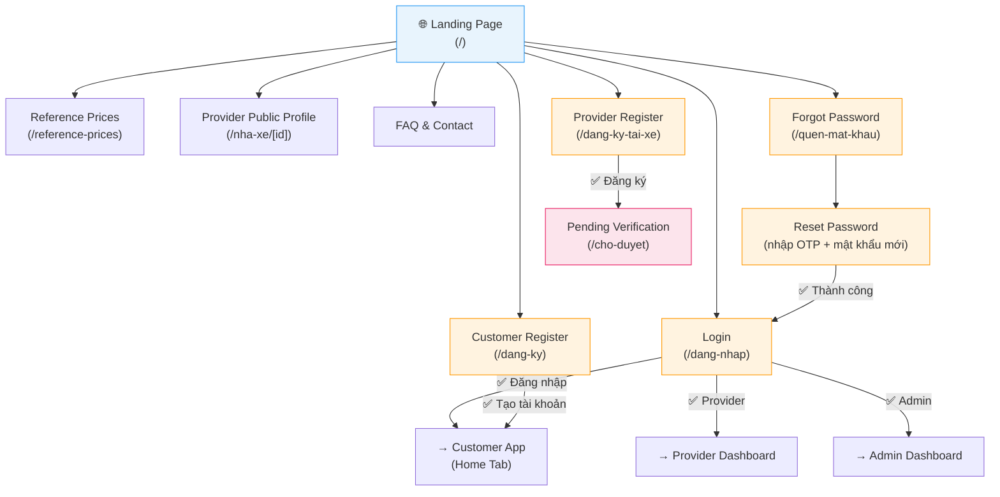

---

## Role 2 — CUSTOMER (Sinh viên đặt dịch vụ)

### 2a. Authentication + App Shell

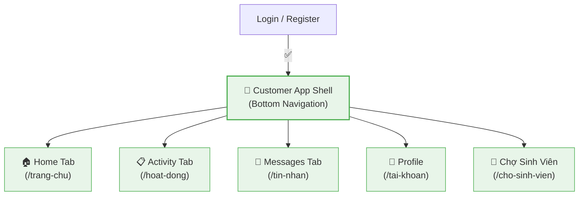

### 2b. Booking Flow — Chuyển nhà Combo / Standard

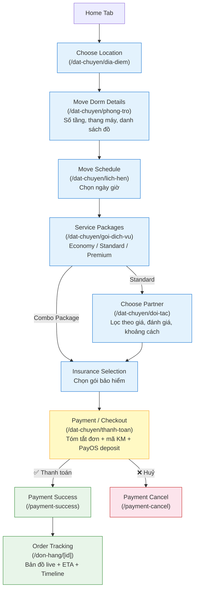

### 2c. Quotation Flow — Đặt theo báo giá

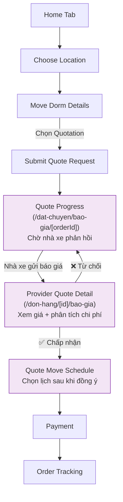

### 2d. Labor Service Flow — Khuân vác đơn lẻ

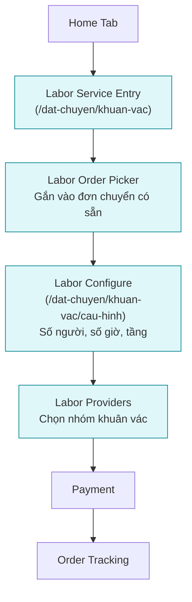

### 2e. Order Management + After-Order

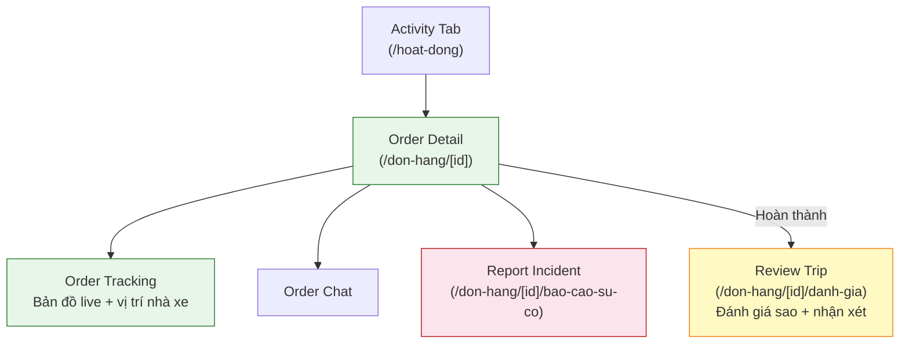

### 2f. Profile + Payment Management

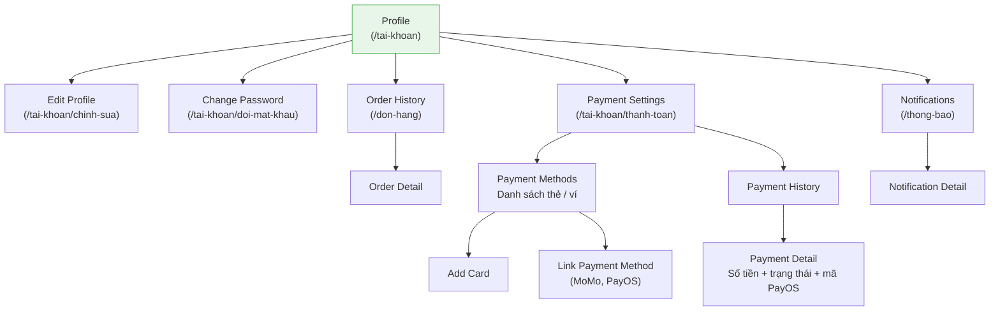

### 2g. Marketplace — Chợ Sinh Viên (Pass đồ)

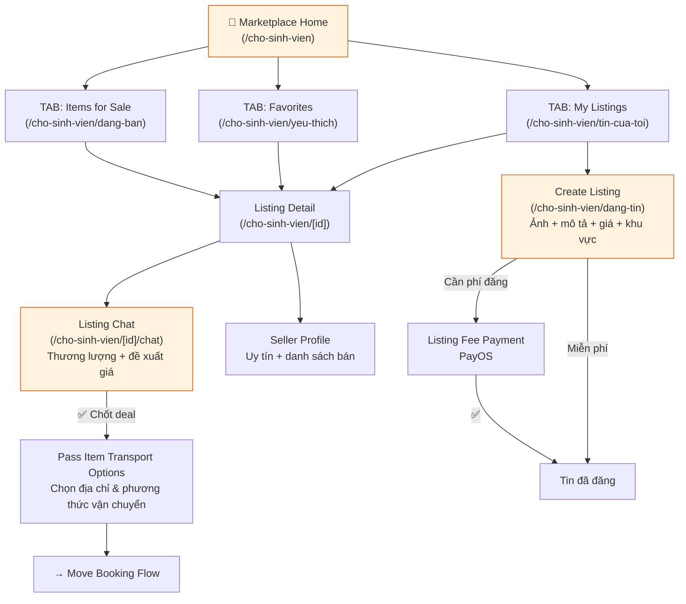

---

## Role 3 — PROVIDER (Nhà xe / Tài xế)

### 3a. Authentication + Onboarding

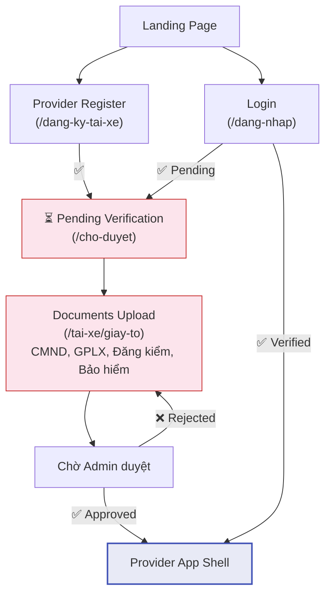

### 3b. Provider App Shell + Orders

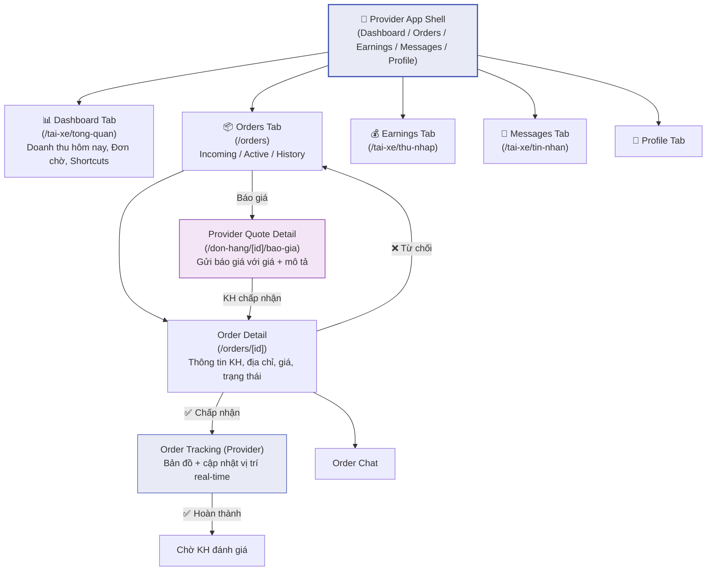

### 3c. Provider Profile + Earnings

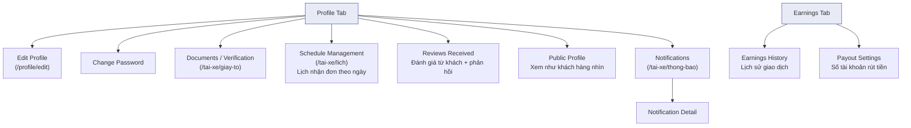

---

## Role 4 — ADMIN (Quản trị viên)

```mermaid
flowchart TD
    ADMIN_LOGIN["🔐 Admin Login\n(/admin)"]
    ADMIN_LOGIN -->|"✅"| DASH_A["📊 Dashboard Overview\n(/admin/dashboard)\nKPI + Revenue Charts + Latest Orders"]

    DASH_A --> USER_MGMT["👥 User Management\n(/admin/users)\nSearch, Suspend, Activate"]
    DASH_A --> VERIF["✅ Provider Verification\n(/admin/verifications)\nReview documents queue"]
    DASH_A --> ORD_MGMT["📦 Order Management\n(/admin/orders)\nAll orders, filters by status/date"]
    DASH_A --> DISPUTES["⚖️ Disputes & Refunds\n(/admin/disputes)\nCustomer complaints + evidence"]
    DASH_A --> REVIEWS_A["📝 Review Management\n(/admin/reviews)\nHide / Unhide / Flag"]
    DASH_A --> ANALYTICS["📈 Analytics\n(/admin/analytics)\nRevenue, GMV, Provider performance"]
    DASH_A --> NOTIF_A["🔔 Notification Management\n(/admin/notifications)\nBroadcast announcements"]
    DASH_A --> LOGS["📋 Activity Logs\n(/admin/activity-logs)\nAudit trail mọi hành động"]
    DASH_A --> SETTINGS["⚙️ Platform Settings\n(/admin/settings)\nCommission, theme, config"]
    DASH_A --> FINANCE["💳 Finance Overview\n(/admin/finance)"]
    DASH_A --> PASS_DO["🛒 Marketplace Moderation\n(/admin/pass-do)"]
    DASH_A --> ADMIN_PRF["👤 Admin Profile\n(/admin/profile)"]

    USER_MGMT -->|"Click user"| USER_D["User Detail\nXem đơn hàng, lịch sử"]
    USER_D --> SUSPEND["Suspend Account"]
    USER_D --> ACTIVATE["Activate Account"]

    VERIF --> DOC_REVIEW["Review Documents\nCMND, GPLX, Đăng kiểm"]
    DOC_REVIEW -->|"✅ Approve"| PROVIDER_ACTIVE["Provider → Active"]
    DOC_REVIEW -->|"❌ Reject + lý do"| PROVIDER_RESUBMIT["Provider re-upload"]

    ORD_MGMT --> ORD_D_A["Order Detail\n(/admin/orders/[id])"]
    ORD_D_A --> FORCE_CANCEL["Force Cancel Order"]
    ORD_D_A --> REFUND_CTX["Initiate Refund"]

    DISPUTES --> DISPUTE_D["Dispute Detail\nEvidence + chat logs"]
    DISPUTE_D -->|"✅ Favor customer"| REFUND_A["Process Refund\n(PayOS)"]
    DISPUTE_D -->|"✅ Favor provider"| CLOSE_D["Close Dispute"]

    REVIEWS_A --> REVIEW_D["Review Detail"]
    REVIEW_D --> HIDE_R["Hide Review"]
    REVIEW_D --> FLAG_R["Flag for investigation"]

    PASS_DO --> LISTING_MOD["Listing Moderation"]
    LISTING_MOD --> HIDE_L["Hide Listing"]
    LISTING_MOD --> APPROVE_L["Approve Listing"]

    style ADMIN_LOGIN fill:#ffebee,stroke:#B71C1C
    style DASH_A fill:#ffebee,stroke:#B71C1C,stroke-width:2px
    style VERIF fill:#fce4ec,stroke:#880E4F
    style DISPUTES fill:#fce4ec,stroke:#880E4F
    style ANALYTICS fill:#f3e5f5,stroke:#4A148C
```

---

## Tóm tắt Screen Authorization

| Screen | Guest | Customer | Provider | Admin |
|--------|-------|----------|----------|-------|
| Landing Page | ✅ | ✅ | ✅ | ✅ |
| Login / Register / Forgot | ✅ | redirect | redirect | ✅ |
| Reset Password | ✅ | ✅ | ✅ | — |
| Home Tab | — | ✅ | — | — |
| Booking Flows | — | ✅ | — | — |
| Order Tracking | — | ✅ | ✅ | — |
| Order Detail | — | ✅ | ✅ | ✅ |
| Marketplace (browse) | ✅ | ✅ | — | — |
| Marketplace (create/fav) | — | ✅ | — | — |
| Provider Dashboard | — | — | ✅ | — |
| Provider Earnings | — | — | ✅ | — |
| Provider Documents | — | — | ✅ | ✅ |
| Admin Dashboard | — | — | — | ✅ |
| Admin Verifications | — | — | — | ✅ |
| Admin Analytics | — | — | — | ✅ |
| Provider Public Profile | ✅ | ✅ | ✅ | ✅ |
| Reference Prices | ✅ | ✅ | — | — |
